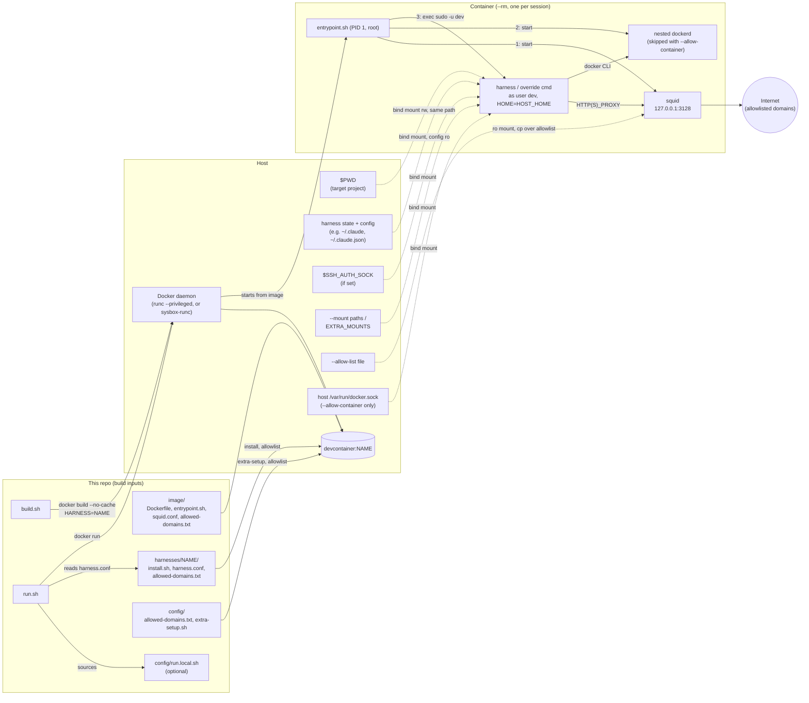

# Devcontainer

Run an AI coding agent like [Claude Code](https://docs.claude.com/en/docs/claude-code) in
full-auto mode without handing it your whole machine.

`run.sh` starts a fresh, throwaway Docker container for the project you're in. The
agent gets your project folder and its own login, nothing else from your home
directory, and only reaches the internet through a domain allowlist. When you exit,
the container is gone.

- **Scoped access:** only `$PWD`, the agent's own state (e.g. `~/.claude`), your SSH
  agent if you have one, and any extra mounts you ask for.
- **Your config stays safe:** hooks, plugins, MCP servers and settings are mounted
  read-only, so a session can't plant something that runs on your host later.
- **Egress allowlist:** outbound HTTP(S) goes through a squid proxy that only lets
  through package registries, GitHub, Docker Hub and the agent's own API.
- **Docker inside:** each session has its own nested Docker daemon, so `docker` and
  `docker compose` work without touching the host's.
- **Pluggable harnesses:** Claude Code ships today. Each tool is a small folder under
  [`harnesses/`](harnesses/), so adding another (e.g. opencode) needs no changes to
  the sandbox itself.

**What it isn't:** a hard security boundary. The proxy guards against accidents, but
a tool that ignores proxy settings can still reach the network, and the container runs
`--privileged` unless you use [sysbox](docs/sysbox.md). The Windows scripts haven't
been tested on Windows yet.

## Requirements

- Linux with Docker. The image is based on Ubuntu 24.04.
- Or Windows 10/11 with Docker Desktop on WSL2: see [docs/windows.md](docs/windows.md),
  where `setup.ps1` installs everything and `build.ps1`/`run.ps1` replace the shell
  scripts.
- Optional: an SSH agent (`$SSH_AUTH_SOCK`) for git-over-SSH inside the container.
- Optional: [sysbox](docs/sysbox.md) for `--sysbox`.

You don't need Claude Code installed on the host; it's installed in the image.

## Quick start

```sh
git clone https://github.com/WildDogOne/Devcontainer.git ~/Devcontainer
cd ~/Devcontainer
./build.sh                     # builds devcontainer:claude (one image per harness)

cd ~/path/to/some-project
~/Devcontainer/run.sh --allow-config   # first run only: log in, see below
~/Devcontainer/run.sh                  # every run after that
```

**First run.** `run.sh` creates `~/.claude` and `~/.claude.json` if they don't exist.
Claude Code then walks you through onboarding and prints a login URL: open it in a
browser on the host and paste the code back into the terminal. `--allow-config` is
needed this once so the onboarding state in `~/.claude.json` is saved; the login token
itself (`~/.claude/.credentials.json`) is saved either way. Later config changes, such
as settings, plugins or MCP servers, need `--allow-config` again. See
[What the container can see](#what-the-container-can-see).

**Shell alias.** To start it from any directory, add this to `~/.bashrc` or `~/.zshrc`
(it works in fish too):

```sh
alias claudecli="$HOME/Devcontainer/run.sh"
```

**Check your setup.** `run.sh --help` lists every flag and what a session on this
machine would get, without starting anything:

```text
Effective config on this machine:
  Harness:        claude
  Image:          devcontainer:claude
  Network:        bridge (default; pass --host-network to change)
  Runtime:        --privileged (default; pass --sysbox to use sysbox-runc instead, if installed)
  Allowlist:      image default (allowed-domains.txt baked in at build; pass --allow-list to override)
  Docker socket:  sandboxed nested dockerd only (default; pass --allow-container to use the host daemon)
  Harness config: read-only (default; pass --allow-config to let the harness change it)
  dev UID:GID:    1000:1000 (your host user)
  Mounts:
    /home/me/project -> /home/me/project
    /home/me/.claude -> /home/me/.claude (dev's $HOME is set to match, see README.md)
    /home/me/.claude/settings.json -> /home/me/.claude/settings.json (ro)
    /home/me/.claude.json -> copied in from a ro mount (edits discarded on exit)
    ...
```

## Usage

```sh
run.sh                    # interactive harness session in $PWD (default: claude)
run.sh --continue         # args starting with `-` are forwarded to the harness
run.sh --permission-mode manual   # claude starts in auto mode by default; this overrides it
run.sh bash               # anything else replaces the harness command entirely
run.sh --help             # flags + this machine's resolved harness/mounts/network/runtime
```

`run.sh` handles the options below itself and doesn't forward them to Docker or the
harness. They can go anywhere in the argument list:

| Flag                                     | Effect (this session only)                                                                                                          |
|------------------------------------------|-------------------------------------------------------------------------------------------------------------------------------------|
| `--harness NAME`                         | Run `harnesses/NAME` (image `devcontainer:NAME`) instead of the default (`$HARNESS`, else `claude`).                                 |
| `--mount PATH` / `--mount HOST:CTR[:ro]` | Extra bind mount. A bare path mounts read-write at the same path on both sides. Repeatable.                                         |
| `--allow-list FILE`                      | Replace the whole egress allowlist with `FILE` (same format as `allowed-domains.txt`).                                              |
| `--allow-internet`                       | Drop the domain allowlist (ports 80/443 only, still proxied and logged). Can't be combined with `--allow-list`.                     |
| `--host-network`                         | Share the host's network namespace instead of the bridge network. For VPNs that block the bridge.                                   |
| `--allow-container`                      | Mount the **host's** Docker socket instead of running a nested `dockerd`. Root-equivalent, see [below](#docker-inside-the-sandbox). |
| `--sysbox`                               | Use the `sysbox-runc` runtime instead of `--privileged`. See [docs/sysbox.md](docs/sysbox.md).                                      |
| `--allow-config`                         | Let the harness change its config on the host. Read-only by default, see [below](#what-the-container-can-see).                      |

```sh
run.sh --mount ~/data --mount ~/models:/models:ro --continue
run.sh --allow-list ./extra-domains.txt
```

## Configuration

Per-machine settings live in `config/`. Each file there is gitignored and has a tracked
`.example` next to it; `build.sh` creates the first two for you on the first build.

| File | Read by | What it's for |
|---|---|---|
| `config/allowed-domains.txt` | `build.sh` | Extra domains to allow, on top of the defaults. See [Network egress](#network-egress). |
| `config/extra-setup.sh` | `build.sh` | Extra packages or tools baked into the image. See [Customizing the image](#customizing-the-image). |
| `config/run.local.sh` | `run.sh` | Default harness (`HARNESS=`), standing mounts (`EXTRA_MOUNTS`), extra read-only paths (`EXTRA_CONFIG_RO_PATHS`), UID override (`CONTAINER_UID`). |
| `config/run.local.ps1` | `run.ps1` | The same for Windows. |

**Rebuild with `./build.sh` after changing anything in `image/`, `harnesses/`,
`config/allowed-domains.txt` or `config/extra-setup.sh`.** All of them are baked into
the image, and a stale image keeps running the old version without any warning.
`build.sh` always builds with `--no-cache` and prunes the dangling images it leaves
behind. `./build.sh claude` builds just one harness; with no arguments it builds all
of them.

## How it works



- **Build time:** `build.sh` builds one image per harness from `image/Dockerfile`. The
  shared part copies in `entrypoint.sh` and `squid.conf` and runs
  `config/extra-setup.sh`. The harness part runs `harnesses/NAME/install.sh`, bakes in
  its `harness.conf`, and assembles the allowlist.
- **Run time:** `run.sh` reads `harnesses/NAME/harness.conf` and starts a fresh `--rm`
  container with only the mounts listed below.
- **Inside the container:** `entrypoint.sh` runs as root. It starts squid (the egress
  proxy), then the nested `dockerd`, then switches to the unprivileged `dev` user to
  run the harness's default command or the command you gave.

### Repository layout

| Path | What's in it |
|---|---|
| `build.sh`, `run.sh` | What you run: build the images, start a session. |
| `build.ps1`, `run.ps1`, `setup.ps1` | The same for Windows, see [docs/windows.md](docs/windows.md). |
| [`harnesses/`](harnesses/) | One folder per supported tool: how to install it, what to mount, which domains it needs. See [harnesses/README.md](harnesses/README.md). |
| `image/` | The shared sandbox: `Dockerfile`, `entrypoint.sh`, the squid config and the default allowlist. Nothing harness-specific. |
| `config/` | Your per-machine settings, see [Configuration](#configuration). |
| `lib/` | Helpers for the PowerShell scripts. |
| `docs/` | Windows and sysbox setup. |

## What the container can see

| Host path                               | Container path        | Why                                                                   |
|-----------------------------------------|-----------------------|-----------------------------------------------------------------------|
| `$PWD`                                  | same path, read-write | Your project. Git and absolute paths behave as on the host.           |
| Harness state, e.g. `~/.claude`         | same path, config ro  | Reuses the harness's login, settings, plugins and MCP config.         |
| Staged files, e.g. `~/.claude.json`     | copied in             | Rewritten by the harness on every start, see below.                   |
| `$SSH_AUTH_SOCK` (if set)               | same path             | Agent-forwarded git-over-SSH. No keys are copied in.                  |
| `EXTRA_MOUNTS` in `config/run.local.sh` | as configured         | Standing mounts for this machine.                                     |
| `--mount` arguments                     | as given              | One-off mounts for a single session.                                  |

Which harness paths are mounted, and how, comes from its `harness.conf` - see
[harnesses/README.md](harnesses/README.md).

Inside the container you're the user `dev`, but with your host UID and GID: `run.sh`
passes them in and `entrypoint.sh` remaps `dev` at startup. Files created in mounted
directories stay owned by you on the host. The remap is skipped when you run as root,
under rootless Docker and under Podman, which already map the container's root to
your user. To pick the IDs yourself, set `CONTAINER_UID` (and optionally
`CONTAINER_GID`) in `config/run.local.sh` or the environment, or `CONTAINER_UID=off` to
keep `dev` at 1000:1000. `run.sh --help` shows which IDs a session will use.

The harness's files are mounted at your host's `$HOME` path, not `/home/dev`, and
`entrypoint.sh` sets `dev`'s `$HOME` to match. Claude Code, for example, records
absolute plugin paths based on `$HOME`. If the two didn't match, plugins you installed
on the host would fail with `cache-miss` on `/reload-plugins`.

By default the container can't change the harness's **configuration**. For Claude
Code: hooks in `settings.json`, MCP servers in `~/.claude.json`, plugins, agents,
commands and skills all run with full access on the host the next time you use `claude`
natively. A session that edits them could therefore escape the sandbox. `~/.claude`
stays read-write because Claude Code needs it for transcripts, history and login token
refreshes. On top of it, `run.sh` mounts `settings.json`, `settings.local.json`,
`CLAUDE.md`, `keybindings.json`, `agents/`, `commands/`, `skills/`, `hooks/`,
`plugins/` and `output-styles/` read-only (each one only if it exists). `~/.claude.json`
is copied into the container instead, because Claude Code rewrites it on every start.
Changes to it inside the session are thrown away when the container exits. So with the
default:

- changing settings, installing plugins or updating marketplaces fails inside the
  container;
- trust prompts and similar state stored in `~/.claude.json` reset every session.

Pass `--allow-config` to mount all of it read-write. If your settings point at other
files (for example a statusline script), add them in `config/run.local.sh` with
`EXTRA_CONFIG_RO_PATHS+=(.claude/statusline.sh)`.

For mounts you need in every session on this machine, copy
`config/run.local.sh.example` to `config/run.local.sh` (gitignored) and fill in
`EXTRA_MOUNTS`. Each extra mount widens the sandbox, so add them deliberately.

## Network egress

All outbound HTTP (S) goes through a squid proxy inside the container, listening only on
`127.0.0.1:3128`. The proxy only lets through the domains in the image's allowlist, which
`build.sh` assembles from three files:

- `image/allowed-domains.txt`: shared defaults (package registries, GitHub, Docker Hub)
- `harnesses/NAME/allowed-domains.txt`: what the harness itself needs
- `config/allowed-domains.txt`: your own additions (gitignored)

One domain per line; a leading `.` also matches subdomains. Add to your own file (and
rebuild) when a workflow needs a new host. For a single session, use `--allow-list FILE`
(replaces the whole list) or `--allow-internet` instead, which needs no rebuild.

`entrypoint.sh` sets the proxy three ways:

- in the environment, as both `HTTP_PROXY`/`HTTPS_PROXY` and lowercase
  `http_proxy`/`https_proxy`
- in apt's config
- in git's config

**This guards against accidents. It is not a hard boundary.** There are no iptables
rules, so a tool that ignores proxy settings can still reach the network directly.

Blocked requests are logged in `/tmp/squid-access.log` inside the container. The file
belongs to root, so read it with `sudo tail /tmp/squid-access.log` when something fails
to download.

`--host-network` swaps isolation for connectivity, for example behind a corporate VPN
that only routes the host's own traffic. Only use it when the bridge network can't reach
the internet.

## Docker inside the sandbox

By default the container runs `--privileged` with its own nested `dockerd`. `docker` and
`docker compose` work inside it. Everything they create stays inside the sandbox and is
deleted when the container exits. The host's Docker daemon isn't reachable.

`--allow-container` mounts the **host's** `/var/run/docker.sock` instead, and the nested
daemon isn't started. Containers you start then run on the host daemon as siblings of
the sandbox, and they outlive it. **This is root-equivalent access to the host**:
`docker run -v /:/host ...` is enough to get a root shell there. Only use it for
sessions that need to drive the host daemon, and only when you trust everything running
inside.

`--privileged` itself leaves little isolation between the nested `dockerd` and the host.
`--sysbox` replaces it with user-namespace isolation. It needs a one-time host install:
see [docs/sysbox.md](docs/sysbox.md).

## Customizing the image

**Another harness.** Add a directory under `harnesses/` - see
[harnesses/README.md](harnesses/README.md).

**Extra dependencies.** Use `config/extra-setup.sh` for anything a custom MCP server or
tool needs that the base image lacks. The base image ships Node 22, Python 3.14,
`uv`/`uvx`, `bun`, `gh`, `ripgrep`, `jq` and `fzf`. Copy
`config/extra-setup.sh.example` to `config/extra-setup.sh` (gitignored) and edit it. The
build runs it as root after the rest of the toolchain is installed, in every harness's
image. If the file is missing, `build.sh` creates a no-op copy.

```sh
# in config/extra-setup.sh:
apt-get update && apt-get install -y --no-install-recommends ffmpeg && rm -rf /var/lib/apt/lists/*
npm install -g some-mcp-server-package
UV_TOOL_DIR=/usr/local/share/uv-tools UV_TOOL_BIN_DIR=/usr/local/bin uv tool install some-python-mcp-server
```

Install binaries into `/usr/local/bin` rather than a home directory, because
`sudo -u dev` doesn't keep `PATH`. For `uv tool`, also move its tool directory as above:
uv's default is under `/root`, which `dev` can't read. If the tool needs network access
at runtime, add its domains to `config/allowed-domains.txt` too.

MCP server *configuration* needs nothing here. The harness's config (e.g.
`~/.claude.json`) is mounted in from the host, so servers you've registered there work
as long as the command they run exists in the image.

**Python.** Python 3.14 (from the deadsnakes PPA) is the default `python3`/`python`.
Each zsh session looks for `.venv/bin/activate` in the current directory and its
parents, and activates the first one it finds. Nothing creates the venv for you: run
`python3.14 -m venv .venv` in the project.

## Troubleshooting

- **`sudo: remote-control: command not found`** (or similar): a harness flag was passed
  without its leading dashes. `run.sh remote-control` is treated as a command to run
  instead of the harness. Use `run.sh --remote-control`.
- **`~/.claude.json` is a directory:** an older version of `run.sh` ran before that
  file existed, so Docker created it as root. Repair with
  `sudo rmdir ~/.claude.json; sudo chown -R "$USER": ~/.claude`, then follow
  the first-run steps in [Quick start](#quick-start).
- **`image devcontainer:NAME not found`:** run `./build.sh NAME`.
- **A change to the image has no effect:** rebuild with `./build.sh`.
- **A download or API call is blocked:** run `sudo tail /tmp/squid-access.log` inside
  the container to see which domain was refused, then use `--allow-list` or add it to
  `config/allowed-domains.txt`.
- **`cache-miss` on `/reload-plugins`:** make sure you started through `run.sh`, which
  keeps `$HOME` in the container the same as on the host. A bare `docker run` doesn't.

## Contributing

Issues and pull requests are welcome at
[github.com/WildDogOne/Devcontainer](https://github.com/WildDogOne/Devcontainer). There's
no test suite: to check a change, rebuild with `./build.sh` and start a session with
`run.sh bash`. Record user-visible changes under `## Unreleased` in
[CHANGELOG.md](CHANGELOG.md). If you change a `run.sh` flag or a mounted path, make the
same change in `run.ps1`.

## License

No license file is included - all rights reserved by default. Open an issue if you'd
like to use this under different terms.
