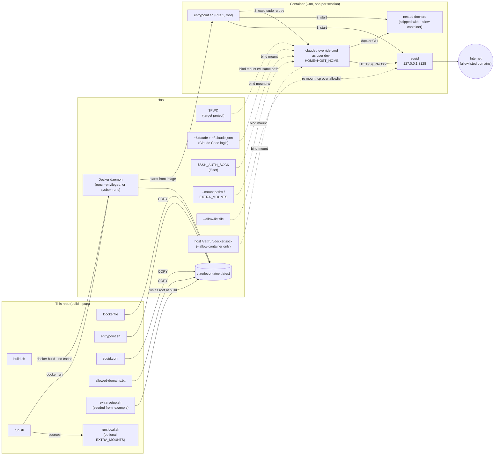

# claudecontainer

A disposable Docker sandbox for running Claude Code (or any other tool in the image)
against one project directory at a time.

Each `run.sh` launches a fresh `--rm` container that can only see:

- the directory you ran it from
- your Claude Code login
- your SSH agent, if you have one
- any extra mounts you ask for

Outbound traffic goes through a domain allowlist, and Docker-in-Docker works inside it.
There's no persistent container, no listening port and no whole-home mount.

## Requirements

- A Linux host with Docker (the image is Ubuntu 24.04-based).
- Optional: an SSH agent (`$SSH_AUTH_SOCK`) for git-over-SSH inside the container.
- Optional: [sysbox](docs/sysbox.md) for `--sysbox`.

## Quick start

```sh
cp allowed-domains.txt.example allowed-domains.txt   # required: the build COPYs it
./build.sh

cd ~/path/to/some-project
/path/to/claudecontainer/run.sh                       # drops you into `claude`
```

To launch it from any directory, add an alias to your host shell config (`~/.bashrc` or
`~/.zshrc`; the same line works in fish):

```sh
alias claudecli="/path/to/claudecontainer/run.sh"
```

**Rebuild with `./build.sh` after changing `Dockerfile`, `entrypoint.sh`, `squid.conf`,
`allowed-domains.txt` or `extra-setup.sh`.** All five are baked into the image, and a
stale image keeps running the old version without any warning. `build.sh` always builds
with `--no-cache` and prunes the dangling images it leaves behind.

## Usage

```sh
run.sh                    # interactive claude session in $PWD
run.sh --continue         # args starting with `-` are forwarded to claude
run.sh bash               # anything else replaces the claude command entirely
run.sh --help             # flags + this machine's resolved mounts/network/runtime
```

`run.sh` handles the options below itself and doesn't forward them to Docker or
`claude`. They can go anywhere in the argument list:

| Flag                                     | Effect (this session only)                                                                                                          |
|------------------------------------------|-------------------------------------------------------------------------------------------------------------------------------------|
| `--mount PATH` / `--mount HOST:CTR[:ro]` | Extra bind mount. A bare path mounts read-write at the same path on both sides. Repeatable.                                         |
| `--allow-list FILE`                      | Replace the egress allowlist with `FILE` (same format as `allowed-domains.txt`).                                                    |
| `--allow-internet`                       | Drop the domain allowlist (ports 80/443 only, still proxied and logged). Can't be combined with `--allow-list`.                     |
| `--host-network`                         | Share the host's network namespace instead of the bridge network. For VPNs that block the bridge.                                   |
| `--allow-container`                      | Mount the **host's** Docker socket instead of running a nested `dockerd`. Root-equivalent, see [below](#docker-inside-the-sandbox). |
| `--sysbox`                               | Use the `sysbox-runc` runtime instead of `--privileged`. See [docs/sysbox.md](docs/sysbox.md).                                      |

```sh
run.sh --mount ~/data --mount ~/models:/models:ro --continue
run.sh --allow-list ./extra-domains.txt
```

## How it works



- **Build time:** `build.sh` builds the image from the `Dockerfile`. The build copies
  in `entrypoint.sh`, `squid.conf` and `allowed-domains.txt`, and runs
  `extra-setup.sh`.
- **Run time:** `run.sh` starts a fresh `--rm` container with only the mounts listed
  below.
- **Inside the container:** `entrypoint.sh` runs as root. It starts squid (the egress
  proxy), then the nested `dockerd`, then switches to the unprivileged `dev` user to
  run `claude` or the command you gave.

## What the container can see

| Host path                        | Container path        | Why                                                              |
|----------------------------------|-----------------------|------------------------------------------------------------------|
| `$PWD`                           | same path, read-write | Your project. Git and absolute paths behave as on the host.      |
| `~/.claude`, `~/.claude.json`    | same path, read-write | Reuses your Claude Code login, settings, plugins and MCP config. |
| `$SSH_AUTH_SOCK` (if set)        | same path             | Agent-forwarded git-over-SSH. No keys are copied in.             |
| `EXTRA_MOUNTS` in `run.local.sh` | as configured         | Standing mounts for this machine.                                |
| `--mount` arguments              | as given              | One-off mounts for a single session.                             |

The Claude config is mounted at your host's `$HOME` path, not `/home/dev`, and
`entrypoint.sh` sets `dev`'s `$HOME` to match. Claude Code records absolute plugin
paths based on `$HOME`. If the two didn't match, plugins you installed on the host
would fail with `cache-miss` on `/reload-plugins`.

For mounts you need in every session on this machine, copy `run.local.sh.example` to
`run.local.sh` (gitignored) and fill in `EXTRA_MOUNTS`. Each extra mount widens the
sandbox, so add them deliberately.

## Network egress

All outbound HTTP (S) goes through a squid proxy inside the container, listening only on
`127.0.0.1:3128`. The proxy only lets through the domains in `allowed-domains.txt`: one
per line, and a leading `.` also matches subdomains. Add to that file (and rebuild) when
a workflow needs a new host. For a single session, use `--allow-list FILE` or
`--allow-internet` instead, which needs no rebuild.

`entrypoint.sh` sets the proxy three ways:

- in the environment, as both `HTTP_PROXY`/`HTTPS_PROXY` and lowercase
  `http_proxy`/`https_proxy`
- in apt's config
- in git's config

**This guards against accidents. It is not a hard boundary.** There are no iptables
rules, so a tool that ignores proxy settings can still reach the network directly.

Blocked requests are logged in `/tmp/squid-access.log` inside the container. Check it
when something fails to download.

`--host-network` swaps isolation for connectivity, for example behind a corporate VPN
that only routes the host's own traffic. Only use it when the bridge network can't reach
the internet.

## Docker inside the sandbox

By default the container runs `--privileged` with its own nested `dockerd`. `docker` and
`docker compose` work inside it. Everything they create stays inside the sandbox and is
deleted when the container exits. The host's Docker daemon isn't reachable.

`--allow-container` mounts the **host's** `/var/run/docker.sock` instead, and the nested
daemon isn't started. Containers you start then run on the host daemon as siblings of
the sandbox, and they outlive it. **This is root-equivalent access to the host**:
`docker run -v /:/host ...` is enough to get a root shell there. Only use it for
sessions that need to drive the host daemon, and only when you trust everything running
inside.

`--privileged` itself leaves little isolation between the nested `dockerd` and the host.
`--sysbox` replaces it with user-namespace isolation. It needs a one-time host install:
see [docs/sysbox.md](docs/sysbox.md).

## Customizing the image

**Extra dependencies.** Use `extra-setup.sh` for anything a custom MCP server or tool
needs that the base image lacks. The base image ships Node 22, Python 3.14, `uv`/`uvx`,
`bun`, `gh`, `ripgrep`, `jq` and `fzf`. Copy `extra-setup.sh.example` to
`extra-setup.sh` (gitignored) and edit it. The build runs it as root after the rest of
the toolchain is installed. If the file is missing, `build.sh` creates a no-op copy.

```sh
# in extra-setup.sh:
apt-get update && apt-get install -y --no-install-recommends ffmpeg && rm -rf /var/lib/apt/lists/*
npm install -g some-mcp-server-package
UV_TOOL_DIR=/usr/local/share/uv-tools UV_TOOL_BIN_DIR=/usr/local/bin uv tool install some-python-mcp-server
```

Install binaries into `/usr/local/bin` rather than a home directory, because
`sudo -u dev` doesn't keep `PATH`. For `uv tool`, also move its tool directory as above:
uv's default is under `/root`, which `dev` can't read. If the tool needs network access
at runtime, add its domains to `allowed-domains.txt` too.

MCP server *configuration* needs nothing here. `~/.claude.json` is mounted in from the
host, so servers you've registered there work as long as the command they run exists in
the image.

**Python.** Python 3.14 (from the deadsnakes PPA) is the default `python3`/`python`.
Each zsh session looks for `.venv/bin/activate` in the current directory and its
parents, and activates the first one it finds. Nothing creates the venv for you: run
`python3.14 -m venv .venv` in the project.

## Troubleshooting

- **`sudo: remote-control: command not found`** (or similar): a `claude` flag was passed
  without its leading dashes. `run.sh remote-control` is treated as a command to run
  instead of `claude`. Use `run.sh --remote-control`.
- **A change to the image has no effect:** rebuild with `./build.sh`.
- **Build fails on `COPY allowed-domains.txt`:** run
  `cp allowed-domains.txt.example allowed-domains.txt`.
- **A download or API call is blocked:** check `/tmp/squid-access.log` inside the
  container, then use `--allow-list` or add the domain to `allowed-domains.txt`.
- **`cache-miss` on `/reload-plugins`:** make sure you started through `run.sh`, which
  keeps `$HOME` in the container the same as on the host. A bare `docker run` doesn't.
